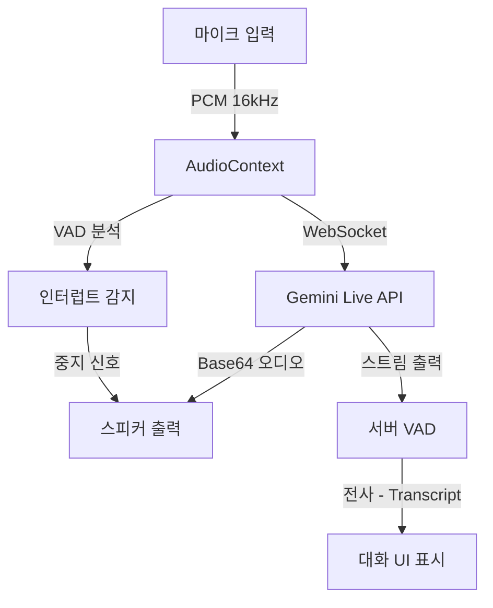

# Gemini English Teacher

<div align="center">


**AI와 함께하는 CEFR B1-B2 레벨 실전 영어 토론 학습**
<br />
초저지연 실시간 음성 대화, 자연스러운 끼어들기(Interrupt), 즉각적인 피드백을 경험해보세요.

[**웹 앱 실행하기**](https://gemini-engilsh-teacher.netlify.app/) · [개발자 가이드](./CLAUDE.md) · [로드맵 & 할 일](./TODO.md) · [버그 제보](https://github.com/HouuYa/Gemini-Engilsh-Teacher/issues)

**최종 업데이트**: 2025-12-09 (v2.2)

</div>

---

## 📖 개요 (Overview)

**Gemini English Teacher**는 텍스트 위주의 학습과 실전 대화 사이의 간극을 줄여주는 고급 언어 학습 애플리케이션입니다. **Google Gemini Multimodal Live API**를 활용하여, 최신 뉴스 주제에 대해 AI 튜터 "Alex"와 매일 새로운 토론을 진행할 수 있습니다.

단순한 챗봇과 달리 **양방향(Full-duplex) 통신**을 지원하여, 실제 사람과 대화하듯 AI의 말을 끊고 끼어들 수 있으며, 문법, 어휘, 유창성에 대한 체계적인 피드백을 제공합니다.

---

## 🚀 핵심 기능 (Key Features)

### 🗣️ 실시간 음성 상호작용 (v2.1+)
- **자연스러운 턴테이킹:** 800ms의 침묵 감지 임계값과 2048 버퍼 사이즈 최적화로 응답 속도를 53% 향상시켰습니다.
- **인터럽트(Interrupt) 지원:** 대화 도중 사용자가 말을 시작하면(-45dB 감지) 즉시 AI의 음성이 중단되어 자연스러운 토론 흐름을 유지합니다.
- **시각적 VAD:** 음성 감지 상태를 UI에서 실시간으로 확인할 수 있습니다.

### 📚 5단계 학습 플로우
1. **브리핑 (Briefing):** Google Search 연동을 통해 최신 뉴스 기사를 분석하고 핵심 어휘를 학습합니다.
2. **토론 (Discussion):** 학습한 주제로 AI 파트너와 실시간 음성 토론을 진행합니다.
3. **피드백 (Feedback):** 대화 내용을 분석하여 문법 교정, 어휘 제안, 유창성 점수를 제공합니다.
4. **쉐도잉 (Shadowing):** 교정된 문장을 TTS로 듣고 따라 말하며 내재화합니다.
5. **완료 (Completion):** 세션을 요약하고 학습을 마무리합니다.

### ⚡ 성능 및 효율성 (v2.2)
- **Safari/iOS 완벽 지원:** `unlockAudioContext` 구현으로 아이폰/아이패드 환경에서도 TTS 및 오디오 재생이 원활합니다.
- **토큰 사용량 최적화:** 프롬프트 엔지니어링을 통해 API 토큰 사용량을 **60-70% 절감**하여, 품질 저하 없이 비용 효율성을 극대화했습니다.
- **모바일 최적화:** Wake Lock API를 적용하여 학습 중 화면 꺼짐을 방지합니다.

---

## 🛠️ 기술 스택 (Tech Stack)

| 분류 | 기술 |
|------|------|
| **Frontend** | React 19.2, TypeScript 5.8, Vite 6.2, Tailwind CSS |
| **AI Core** | Google GenAI SDK (v1.29), Gemini 2.5 Flash/Pro, Gemini Native Audio |
| **Audio** | Web Audio API, ScriptProcessorNode (2048 buffer), AnalyserNode (VAD) |
| **Services** | Google Search Tool, Gemini TTS (Text-to-Speech) |
| **Deployment** | Netlify |

---

## 🏗️ 아키텍처 (Architecture)

복잡한 오디오 스트림을 처리하여 낮은 지연 시간을 보장하는 구조입니다.



상세한 코드 구조, 상태 관리, 서비스 레이어 설명은 [**CLAUDE.md (개발자 가이드)**](./CLAUDE.md)를 참고하세요.

---

## ⚡ 빠른 시작 (Quick Start)

### 필수 조건
- Node.js v18 이상
- Google Gemini API 키 ([여기서 발급](https://aistudio.google.com/app/apikey))

### 설치 및 실행

1.  **저장소 복제**
    ```bash
    git clone https://github.com/HouuYa/Gemini-Engilsh-Teacher.git
    cd Gemini-Engilsh-Teacher
    ```

2.  **의존성 설치**
    ```bash
    npm install
    ```

3.  **환경 변수 설정**
    루트 경로에 `.env.local` 파일을 생성하고 API 키를 입력합니다:
    ```bash
    echo "GEMINI_API_KEY=your_actual_api_key_here" > .env.local
    ```

4.  **개발 서버 실행**
    ```bash
    npm run dev
    ```
    브라우저에서 `http://localhost:3000`으로 접속합니다.

---

## 📅 변경 내역 (Changelog)

### v2.2 (2025-12-09) - *성능 최적화 업데이트*
- **🔥 토큰 최적화:** 프롬프트 구조 개선으로 API 토큰 사용량 60-70% 감소 (비용 절감 및 속도 향상).
- **🐛 Safari 호환성 패치:** iOS Safari에서 오디오 컨텍스트가 잠기는 문제를 해결하여 TTS 재생 오류 수정.
- **코드 품질:** 불필요한 콘솔 로그 제거 및 개발 환경 전용 디버깅 로그 추가.

### v2.1 (2025-12-03) - *실시간성 강화 업데이트*
- **인터럽트 기능:** AI 발화 중 사용자 음성 감지 시 즉시 재생 중단 및 듣기 모드 전환.
- **레이턴시 개선:** 오디오 버퍼(4096→2048) 및 침묵 감지 시간(1.5s→0.8s) 단축.
- **UI 개선:** 실시간 음성 감지 표시기(Listening indicator) 추가.

---

## 🗺️ 로드맵 (Roadmap)

현재 진행 중인 주요 작업은 다음과 같습니다:

- [ ] **Supabase 통합:** 학습 이력 저장 및 장기적인 실력 향상 추적.
- [ ] **Gemini Pro TTS:** 쉐도잉 단계에 더 자연스러운 Pro 모델 음성 적용.
- [ ] **AudioWorklet 도입:** `ScriptProcessorNode`를 대체하여 메인 스레드 부하 감소.
- [ ] **n8n 자동화:** 일일 학습 알림 및 주간 리포트 자동 발송.

전체 작업 목록은 [TODO.md](./TODO.md)에서 확인하실 수 있습니다.

---

## 🤝 기여하기 (Contributing)

이 프로젝트는 오픈 소스이며 여러분의 기여를 환영합니다:

1. 프로젝트를 Fork 합니다.
2. 기능 브랜치를 생성합니다 (`git checkout -b feature/AmazingFeature`).
3. 변경 사항을 Commit 합니다 (`git commit -m 'Add some AmazingFeature'`).
4. 브랜치에 Push 합니다 (`git push origin feature/AmazingFeature`).
5. Pull Request를 생성합니다.

**참고:** 코드 작성 전 [CLAUDE.md](./CLAUDE.md)의 코딩 컨벤션을 확인해주세요.

---

## 📄 라이선스 (License)

이 프로젝트는 MIT 라이선스를 따릅니다. Google AI Studio의 초기 컨셉을 바탕으로 Calude Code를 이용하여 프로덕션 레벨로 확장 개발되었습니다.

---

<div align="center">
Made with ❤️ by <a href="https://github.com/HouuYa">HouuYa</a>
</div>
